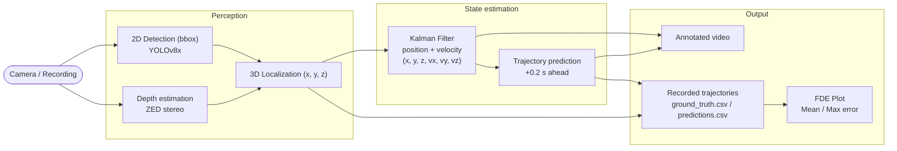

# System Overview

```mermaid
flowchart LR
    SENSOR([Camera / Recording])

    SENSOR --> A
    SENSOR --> B
    C --> D
    C --> CSV
    D --> VIS
    E --> VIS
    E --> CSV

    subgraph PERCEIVE["Perception"]
        direction TB
        A["2D Detection (bbox)<br/>YOLOv8x"]
        B["Depth estimation<br/>ZED stereo"]
        A & B --> C["3D Localization (x, y, z)"]
    end

    subgraph TRACK["State estimation"]
        direction TB
        D["Kalman Filter<br/>position + velocity <br/>(x, y, z, vx, vy, vz)"]
        D --> E["Trajectory prediction<br/>+0.2 s ahead"]
    end

    subgraph OUTPUT["Output"]
        direction TB
        VIS["Annotated video"]
        CSV["Recorded trajectories<br/>ground_truth.csv / predictions.csv"]
        CSV --> PLOT["FDE Plot<br/>Mean / Max error"]
    end
```
