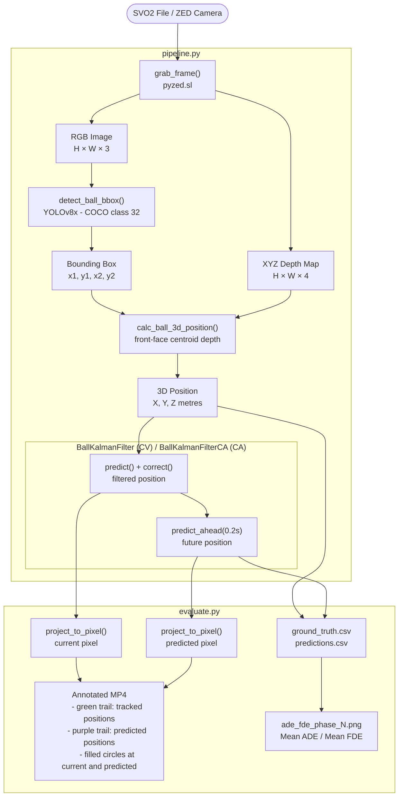

# System Architecture

```mermaid
flowchart TD
    INPUT([SVO2 File / ZED Camera])

    INPUT --> GRAB

    subgraph pipeline.py
        GRAB["grab_frame()
        pyzed.sl"]

        GRAB --> RGB["RGB Image
        H × W × 3"]
        GRAB --> XYZ["XYZ Depth Map
        H × W × 4"]

        RGB --> DETECT["detect_ball_bbox()
        YOLOv8x - COCO class 32"]
        DETECT --> BBOX["Bounding Box
        x1, y1, x2, y2"]

        BBOX --> DEPTH["calc_ball_3d_position()
        front-face centroid depth"]
        XYZ --> DEPTH

        DEPTH --> POS["3D Position
        X, Y, Z  metres"]

        POS --> PRED

        subgraph KF["BallKalmanFilter (CV) / BallKalmanFilterCA (CA)"]
            PRED["predict() + correct()
            filtered position"]
            PRED --> AHEAD["predict_ahead(0.2s)
            future position"]
        end
    end

    subgraph evaluate.py
        PRED --> P2P_CUR["project_to_pixel()
        current pixel"]
        AHEAD --> P2P_PRED["project_to_pixel()
        predicted pixel"]

        P2P_CUR --> VID["Annotated MP4
        - green trail: tracked positions
        - purple trail: predicted positions
        - filled circles at current and predicted"]
        P2P_PRED --> VID

        POS --> CSV["ground_truth.csv
        predictions.csv"]
        AHEAD --> CSV

        CSV --> PLOT["ade_fde_phase_N.png
        Mean ADE / Mean FDE"]
    end
```
