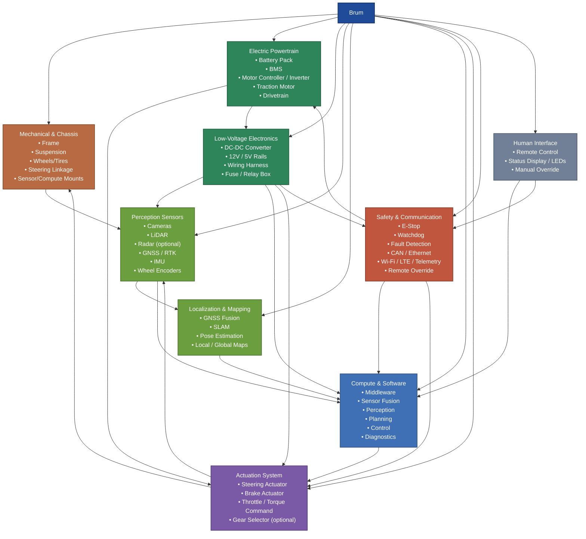

# Autonomous Electric ATV System

```mermaid

flowchart TD
    %% Top-level title node
    VEH["Brum"]

    %% Core domains
    CH["Mechanical & Chassis
    • Frame
    • Suspension
    • Wheels/Tires
    • Steering Linkage
    • Sensor/Compute Mounts"]

    PT["Electric Powertrain
    • Battery Pack
    • BMS
    • Motor Controller / Inverter
    • Traction Motor
    • Drivetrain"]

    LV["Low-Voltage Electronics
    • DC-DC Converter
    • 12V / 5V Rails
    • Wiring Harness
    • Fuse / Relay Box"]

    PS["Perception Sensors
    • Cameras
    • LiDAR
    • Radar (optional)
    • GNSS / RTK
    • IMU
    • Wheel Encoders"]

    LM["Localization & Mapping
    • GNSS Fusion
    • SLAM
    • Pose Estimation
    • Local / Global Maps"]

    CS["Compute & Software
    • Middleware
    • Sensor Fusion
    • Perception
    • Planning
    • Control
    • Diagnostics"]

    ACT["Actuation System
    • Steering Actuator
    • Brake Actuator
    • Throttle / Torque Command
    • Gear Selector (optional)"]

    SAFE["Safety & Communication
    • E-Stop
    • Watchdog
    • Fault Detection
    • CAN / Ethernet
    • Wi-Fi / LTE / Telemetry
    • Remote Override"]

    HMI["Human Interface
    • Remote Control
    • Status Display / LEDs
    • Manual Override"]

    %% Vehicle contains subsystems
    VEH --> CH
    VEH --> PT
    VEH --> LV
    VEH --> PS
    VEH --> LM
    VEH --> CS
    VEH --> ACT
    VEH --> SAFE
    VEH --> HMI

    %% Functional relationships
    PS --> LM
    PS --> CS
    LM --> CS
    CS --> ACT
    ACT --> CH

    PT --> ACT
    PT --> LV
    LV --> PS
    LV --> CS
    LV --> ACT
    LV --> SAFE

    SAFE --> CS
    SAFE --> ACT
    SAFE --> PT
    HMI --> CS
    HMI --> SAFE

    %% Feedback / state estimation
    CH --> PS
    ACT --> PS

    %% Styling
    classDef vehicle fill:#1f4b99,color:#fff,stroke:#16376f,stroke-width:2px;
    classDef mech fill:#b86b43,color:#fff,stroke:#7d4428,stroke-width:1.5px;
    classDef power fill:#2f855a,color:#fff,stroke:#1f5c3e,stroke-width:1.5px;
    classDef sensing fill:#6b9e3f,color:#fff,stroke:#486b2b,stroke-width:1.5px;
    classDef compute fill:#3f6fb5,color:#fff,stroke:#294b7b,stroke-width:1.5px;
    classDef act fill:#7a5aa6,color:#fff,stroke:#50396f,stroke-width:1.5px;
    classDef safety fill:#c0563d,color:#fff,stroke:#7f3828,stroke-width:1.5px;
    classDef hmi fill:#718096,color:#fff,stroke:#4a5568,stroke-width:1.5px;

    class VEH vehicle;
    class CH mech;
    class PT,LV power;
    class PS,LM sensing;
    class CS compute;
    class ACT act;
    class SAFE safety;
    class HMI hmi;

```