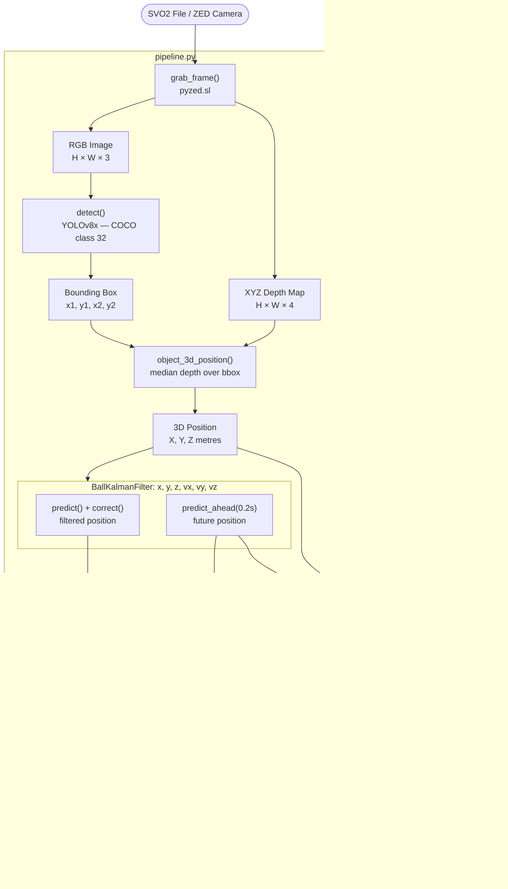

# System Architecture

```mermaid
flowchart TD
    INPUT([SVO2 File / ZED Camera])

    INPUT --> GRAB

    subgraph pipeline.py
        GRAB["grab_frame()
        pyzed.sl"]

        GRAB --> RGB["RGB Image
        H × W × 3"]
        GRAB --> XYZ["XYZ Depth Map
        H × W × 4"]

        RGB --> DETECT["detect()
        YOLOv8x — COCO class 32"]
        DETECT --> BBOX["Bounding Box
        x1, y1, x2, y2"]

        BBOX --> DEPTH["object_3d_position()
        median depth over bbox"]
        XYZ --> DEPTH

        DEPTH --> POS["3D Position
        X, Y, Z  metres"]

        POS --> KF

        subgraph KF["BallKalmanFilter: x, y, z, vx, vy, vz"]
        
            PRED["predict() + correct()
            filtered position"]
            AHEAD["predict_ahead(0.2s)
            future position"]
        end

        PRED --> P2P_CUR["project_to_pixel()
        current pixel"]
        AHEAD --> P2P_PRED["project_to_pixel()
        predicted pixel"]
    end

    P2P_CUR --> MAIN
    P2P_PRED --> MAIN

    subgraph MAIN["main.py"]
        VID["Annotated MP4
        - green trail: actual
        - red trail: predicted
        - colour ring: error magnitude"]
    end

    POS --> EVAL
    AHEAD --> EVAL

    subgraph EVAL["evaluate.py"]
        CSV["ground_truth.csv
        predictions.csv"]
        PLOT["fde_plot.png
        Mean / Max FDE"]
    end
```
