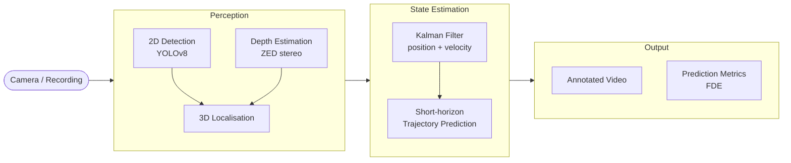

# System Overview

```mermaid
flowchart LR
    SENSOR([Camera / Recording])

    SENSOR --> PERCEIVE
    PERCEIVE --> TRACK
    TRACK --> OUTPUT

    subgraph PERCEIVE["Perception"]
        direction TB
        A["2D Detection\nYOLOv8"]
        B["Depth Estimation\nZED stereo"]
        A & B --> C["3D Localisation"]
    end

    subgraph TRACK["State Estimation"]
        direction TB
        D["Kalman Filter\nposition + velocity"]
        D --> E["Short-horizon\nTrajectory Prediction"]
    end

    subgraph OUTPUT["Output"]
        direction TB
        VIS["Annotated Video"]
        EVAL["Prediction Metrics\nFDE"]
    end
```
